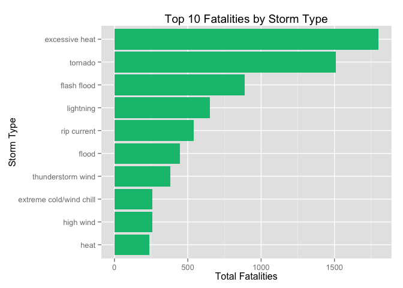

# Exploring the economic and population health consequences of storms

## Synopsis

This project involves exploring the U.S. National Oceanic and Atmospheric Administration's (NOAA) storm database. This database tracks characteristics of major storms and weather events in the United States, including when and where they occur, as well as estimates of any fatalities, injuries, and property damage.

We would like to answer the following questions:

1. Across the United States, which types of events are most harmful with respect to population health?
2. Across the United States, which types of events have the greatest economic consequences?

## Data Processing

Load the necessary packages:


```r
library(dplyr)
```

```
## 
## Attaching package: 'dplyr'
## 
## The following objects are masked from 'package:stats':
## 
##     filter, lag
## 
## The following objects are masked from 'package:base':
## 
##     intersect, setdiff, setequal, union
```

```r
library(ggplot2)
library(stringr)
library(lubridate)
library(R.utils)
```

```
## Loading required package: R.oo
## Loading required package: R.methodsS3
## R.methodsS3 v1.7.0 (2015-02-19) successfully loaded. See ?R.methodsS3 for help.
## R.oo v1.19.0 (2015-02-27) successfully loaded. See ?R.oo for help.
## 
## Attaching package: 'R.oo'
## 
## The following objects are masked from 'package:methods':
## 
##     getClasses, getMethods
## 
## The following objects are masked from 'package:base':
## 
##     attach, detach, gc, load, save
## 
## R.utils v2.1.0 (2015-05-27) successfully loaded. See ?R.utils for help.
## 
## Attaching package: 'R.utils'
## 
## The following object is masked from 'package:utils':
## 
##     timestamp
## 
## The following objects are masked from 'package:base':
## 
##     cat, commandArgs, getOption, inherits, isOpen, parse, warnings
```

Read the storm data, change the field names to lower case, subset the data to pull fields that matters, and convert event type values to lowercase.


```r
bunzip2("repdata-data-StormData.csv.bz2", remove = FALSE, overwrite = TRUE)
data <- read.csv("repdata-data-StormData.csv", stringsAsFactors = FALSE)
names(data) <- tolower(names(data))
subdata <- select(data, bgn_date, state, evtype, fatalities, injuries, propdmg, propdmgexp, cropdmg, cropdmgexp, remarks)
subdata$evtype <- tolower(subdata$evtype)
```

Scrub data and clean up event type field. There are many inconsistencies in spellings for event types, so, much of this code chunk is to address that. There are also event types that are combinations of many events such as "heavy wind and lightning". In such cases, we will assume that the first event is the primary event and will refer to that for analysis purposes. For values that do not match any of the defined event types, we will make intelligent guesses and fit them into the defined values as much as possible.


```r
subdata$evtype <- str_trim(subdata$evtype, side = "both")
subdata$evtype <- gsub("^tstmw$", "thunderstorm wind", subdata$evtype)
subdata$evtype <- gsub("^tstm.*", "thunderstorm", subdata$evtype)
subdata$evtype <- gsub("^thu.*", "thunderstorm wind", subdata$evtype)
subdata$evtype <- gsub("^flash.*", "flash flood", subdata$evtype)
subdata$evtype <- gsub("^hail.*", "hail", subdata$evtype)
subdata$evtype <- gsub("^high w.*", "high wind", subdata$evtype)
subdata$evtype <- gsub("^heavy sn.*", "heavy snow", subdata$evtype)
subdata$evtype <- gsub("^heavy r.*", "heavy rain", subdata$evtype)
subdata$evtype <- gsub("^heavy su.*", "heavy surf", subdata$evtype)
subdata$evtype <- gsub(".*floodin.*", "flood", subdata$evtype)
subdata$evtype <- gsub("^flood.*", "flood", subdata$evtype)
subdata$evtype <- gsub("^summary.*", "summary (ignore)", subdata$evtype)
subdata$evtype <- gsub("^rip c.*", "rip current", subdata$evtype)
subdata$evtype <- gsub("^lightning.*", "lightning", subdata$evtype)
subdata$evtype <- gsub("^hurricane.*", "hurricane", subdata$evtype)
subdata$evtype <- gsub("^typhoon.*", "typhoon", subdata$evtype)
subdata$evtype <- gsub("^torna.*", "tornado", subdata$evtype)
subdata$evtype <- gsub("^watersp.*", "waterspout", subdata$evtype)
subdata$evtype <- gsub("^frost.*", "frost/freeze", subdata$evtype)
subdata$evtype <- gsub("^freeze.*", "frost/freeze", subdata$evtype)
subdata$evtype <- gsub("^tropical s.*", "tropical storm", subdata$evtype)
subdata$evtype <- gsub("^coastal.*", "coastal flood", subdata$evtype)
subdata$evtype <- gsub("^blizzard.*", "blizzard", subdata$evtype)
subdata$evtype <- gsub("^volcanic.*", "volcanic ash", subdata$evtype)
subdata$evtype <- gsub("^wild.*", "wildfire", subdata$evtype)
subdata$evtype <- gsub("^beach.*", "coastal flood", subdata$evtype)
subdata$evtype <- gsub("^avalan.*", "avalanche", subdata$evtype)
subdata$evtype <- gsub("^funnel.*", "funnel cloud", subdata$evtype)
subdata$evtype <- gsub("^freezing fog$", "fog", subdata$evtype)
subdata$evtype <- gsub("^freezing.*$", "frost/freeze", subdata$evtype)
subdata$evtype <- gsub("^fog$", "freezing fog", subdata$evtype)
subdata$evtype <- gsub("^unseason.*warm.*", "heat", subdata$evtype)
subdata$evtype <- gsub("^unseason.*co.*", "cold/wind chill", subdata$evtype)
subdata$evtype <- gsub("^unseason.*rain.*|^unseason.*wet.*", "heavy rain", subdata$evtype)
subdata$evtype <- gsub("^unseason.*hot.*|^unseason.*dry.*", "heat", subdata$evtype)
subdata$evtype <- gsub("^unseason.*low temp.*", "cold/wind chill", subdata$evtype)
subdata$evtype <- gsub("^ext.*co.*|^exc.*co.*|^ext.*wind.*|^record.*co.*|^record.*co.*|^record low$|^unusual.*cold", "extreme cold/wind chill", subdata$evtype)
subdata$evtype <- gsub("^ext.*he.*|^exc.*he.*|^record.*hi.*|^record.*he.*|^record.*warm.*|^unusual.*warmth.*|^very warm$", "excessive heat", subdata$evtype)
subdata$evtype <- gsub("^exc.*prec.*|^exc.*rai.*|^exc.*wet.*|^ext.*wet.*|^record.*prec.*|^record.*rai.*|^torr.*rai.*", "heavy rain", subdata$evtype)
subdata$evtype <- gsub("^exc.*dry.*|^record.*dry.*|^very.*dry.*", "drought", subdata$evtype)
subdata$evtype <- gsub("^exc.*snow.*|^record.*snow.*|^unusual.*snow.*", "heavy snow", subdata$evtype)
subdata$evtype <- gsub("^sleet.*", "sleet", subdata$evtype)
subdata$evtype <- gsub(".*microb.*|.*mircob.*|.*micob.*", "thunderstorm wind", subdata$evtype)
subdata$evtype <- gsub("^dry.*|^driest.*|^drou.*", "drought", subdata$evtype)
subdata$evtype <- gsub("^sno.*", "winter weather", subdata$evtype)
subdata$evtype <- gsub("^winter storm.*", "winter storm", subdata$evtype)
subdata$evtype <- gsub("^winter.*mix$|^winter weather.*|^wintry.*", "winter weather", subdata$evtype)
subdata$evtype <- gsub("^urban.*|^small stream.*|^sml stream.*", "flood", subdata$evtype)
subdata$evtype <- gsub("^blowing sn.*", "heavy snow", subdata$evtype)
subdata$evtype <- gsub("^light sn.*", "winter weather", subdata$evtype)
subdata$evtype <- gsub("^heavy precip.*", "heavy rain", subdata$evtype)
subdata$evtype <- gsub("^heat.*", "heat", subdata$evtype)
subdata$evtype <- gsub("^dust dev.*", "dust devil", subdata$evtype)
subdata$evtype <- gsub("^dust st.*|^dusts.*", "dust storm", subdata$evtype)
subdata$evtype <- gsub("^gusty w.*", "strong wind", subdata$evtype)
subdata$evtype <- gsub("^gusty thunder.*", "thunderstorm wind", subdata$evtype)
subdata$evtype <- gsub("^gustna.*", "tornado", subdata$evtype)
subdata$evtype <- gsub("^wind chill.*", "cold/wind chill", subdata$evtype)
subdata$evtype <- gsub("^wind.*", "high wind", subdata$evtype)
subdata$evtype <- gsub(".*lake.*snow.*", "lake-effect snow", subdata$evtype)
subdata$evtype <- gsub("^gusty lake wind$", "seche", subdata$evtype)
subdata$evtype <- gsub("^lake.*flood.*", "lakeshore flood", subdata$evtype)
subdata$evtype <- gsub("^severe cold.*", "extreme cold/wind chill", subdata$evtype)
subdata$evtype <- gsub("^fog and cold.*", "freezing fog", subdata$evtype)
subdata$evtype <- gsub("^cold.*", "cold/wind chill", subdata$evtype)
subdata$evtype <- gsub("^rain.*|^prolonged rain$|^early rain$|^monthly rainfall$|^hvy rain$|^locally heavy rain$", "heavy rain", subdata$evtype)
subdata$evtype <- gsub("^light freezing rain$", "winter weather", subdata$evtype)
subdata$evtype <- gsub(".*ice.*storm.*", "ice storm", subdata$evtype)
subdata$evtype <- gsub("^ice storm$", "storm storm storm", subdata$evtype)
subdata$evtype <- gsub(".*ice.*|.*icy.*", "winter weather", subdata$evtype)
subdata$evtype <- gsub("storm storm storm", "ice storm", subdata$evtype)
subdata$evtype <- gsub(".*landslide.*|.*muds.*|.*mud.*slide.*", "debris flow", subdata$evtype)
subdata$evtype <- gsub("^strong win.*", "strong wind", subdata$evtype)
subdata$evtype <- gsub("^erosion/cstl flood.*", "coastal flood", subdata$evtype)
subdata$evtype <- gsub("^local flash flood.*", "flash flood", subdata$evtype)
subdata$evtype <- gsub("^local flood.*|^m.*flood.*|^r.*flood.*|^street flood.*|^tidal flood.*", "flood", subdata$evtype)
subdata$evtype <- gsub("^deep hail.*|^late season hail.*|^non severe hail.*|^small hail.*", "hail", subdata$evtype)
subdata$evtype <- gsub("^storm surge.*", "storm surge/tide", subdata$evtype)
subdata$evtype <- gsub("^severe thun.*", "tornado", subdata$evtype)
subdata$evtype <- gsub(".*frost$", "frost/freeze", subdata$evtype)
subdata$evtype <- gsub(".*freeze$", "frost/freeze", subdata$evtype)
subdata$evtype <- gsub(".*warm.*", "heat", subdata$evtype)
subdata$evtype <- gsub(".*wet snow.*", "sleet", subdata$evtype)
subdata$evtype <- gsub("^early snow.*|^acc.*snow.*|^dri.*snow.*|^fir.*snow.*|^lac.*snow.*|^lat.*snow.*|^mo.*snow.*|^near.*snow.*|^pro.*snow.*|^sea.*snow.*", "winter weather", subdata$evtype)
subdata$evtype <- gsub("^cool.*", "cold/wind chill", subdata$evtype)
subdata$evtype <- gsub("^hot.*", "heat", subdata$evtype)
subdata$evtype <- gsub("^hyp.*thermia.*", "cold/wind chill", subdata$evtype)
subdata$evtype <- gsub("^^high sur.*|high sea.*|^high.*sw.*|^high tides$", "high surf", subdata$evtype)
subdata$evtype <- gsub("^high.*win.*", "high wind", subdata$evtype)
subdata$evtype <- gsub("^high temp.*", "excessive heat", subdata$evtype)
subdata$evtype <- gsub("^wa.*spout.*", "waterspout", subdata$evtype)
subdata$evtype <- gsub("^wet.*", "heavy rain", subdata$evtype)
subdata$evtype <- gsub("^torn.*", "tornado", subdata$evtype)
subdata$evtype <- gsub("^smoke.*", "dense smoke", subdata$evtype)
subdata$evtype <- gsub("^lig.*", "lightning", subdata$evtype)
subdata$evtype <- gsub("^low.*", "cold/wind chill", subdata$evtype)
subdata$evtype <- gsub("^bitter win.*", "extreme cold/wind chill", subdata$evtype)
subdata$evtype <- gsub("^gradient win.*", "rip current", subdata$evtype)
subdata$evtype <- gsub("^glaze.*", "freezing fog", subdata$evtype)
subdata$evtype <- gsub("^heavy sho.*", "heavy rain", subdata$evtype)
subdata$evtype <- gsub("^brush.*|^grass fires$", "wildfire", subdata$evtype)
```

Add event year to the dataset and discard data prior to 1996. This is because the Storm Database only has complete dataset for all events that occured from 1996 onwards. See the page here: (https://www.ncdc.noaa.gov/stormevents/details.jsp) 


```r
subdata <- mutate(subdata, date = as.Date(data$bgn_date, "%m/%d/%Y %H:%M:%S"))
subdata <- mutate(subdata, event_year = year(date))
subdata <- filter(subdata, event_year >= 1996)
```

Add fields tocalculate the true value of property and crop damage.


```r
subdata <- mutate(subdata, propdmgtotal = ifelse(propdmgexp == "K", propdmg * 1000, ifelse(propdmgexp == "M", propdmg * 1000000, ifelse(propdmgexp == "B",propdmg * 1000000000, propdmg *1))))
subdata <- mutate(subdata, cropdmgtotal = ifelse(cropdmgexp == "K", cropdmg * 1000, ifelse(cropdmgexp == "M", cropdmg * 1000000, ifelse(cropdmgexp == "B",cropdmg * 1000000000, cropdmg *1))))
subdata <- mutate(subdata, totaldmg = propdmgtotal + cropdmgtotal)
```

Create subsets of data for economic damages, fatalities, and injuries


```r
totaldmg <- arrange(top_n(summarise(group_by(subdata, evtype), total_damage = sum(totaldmg)/1000000), 10), desc(total_damage))
```

```
## Selecting by total_damage
```

```r
fatalities <- arrange(top_n(summarise(group_by(subdata, evtype), fatalities = sum(fatalities)), 10), desc(fatalities))
```

```
## Selecting by fatalities
```

```r
injuries <- arrange(top_n(summarise(group_by(subdata, evtype), injuries = sum(injuries)), 10), desc(injuries))
```

```
## Selecting by injuries
```

## Results

Natural storms have tremendous economic consequences. We aggregated total property and crop damages between 1996 to 2011 in the United States and came up with the top 10 storm types. Flood tops the list with over $150 billion in economic damages over the 15-year period, followed by hurricanes, and storm surge.


```r
ggplot(data = totaldmg, aes(x = reorder(evtype, total_damage), y = total_damage)) + geom_bar(stat = "identity", fill = "#F8766D") + coord_flip() + ggtitle("Top 10 Property and Crop Damage by Storm Type") + ylab("Total Damage (in million dollars)") + xlab("Storm Type")
```

 

As for health consequences, I looked at both fatalities and injuries. Data has suggested that excessive heat and tornadoes caused the most deaths with approximately 1,800 and 1,500 people respectively. 


```r
ggplot(data = fatalities, aes(x = reorder(evtype, fatalities), y = fatalities)) + geom_bar(stat = "identity", fill = "#00BF7D") + coord_flip() + ggtitle("Top 10 Fatalities by Storm Type") + ylab("Total Fatalities") + xlab("Storm Type")
```

 

In addition to deaths, tornadoes also topped the top 10 injuries list. It caused the most injuries by far compared to the rest on this list. Flood is second and excessive heat is third with a little over 6,000 in the 15-year period.


```r
ggplot(data = injuries, aes(x = reorder(evtype, injuries), y = injuries)) + geom_bar(stat = "identity", fill = "#00B0F6") + coord_flip() + ggtitle("Top 10 Injuries by Storm Type") + ylab("Total Injuries") + xlab("Storm Type")
```

 
